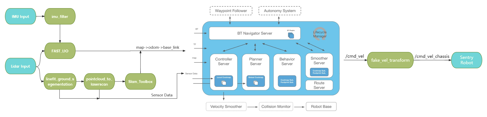

### 1.1 整体框图



### 1.2 基础运行
```sh
# 查看端口
ls /dev/ttyACM* /dev/ttyUSB* /dev/ttyShaobing 
# 单独编译 
colcon build --symlink-install --packages-select rm_serial_driver
# 启动通讯
ros2 launch rm_serial_driver rm_serial_driver.launch.py
# 源码全编译
colcon build --symlink-install --parallel-workers 1  

source /opt/ros/humble/setup.bash
source ./install/setup.bash
```

### 1.3 可选参数

1. `world`:

    - 仿真模式
        - `RMUL` - [2024 Robomaster 3V3 场地](https://bbs.robomaster.com/forum.php?mod=viewthread&tid=22942&extra=page%3D1)
        - `RMUC` - [2024 Robomaster 7V7 场地](https://bbs.robomaster.com/forum.php?mod=viewthread&tid=22942&extra=page%3D1)

    - 真实环境
        - 自定，world 等价于 `.pcd(ICP使用的点云图)` 文件和 `.yaml(Nav使用的栅格地图)` 的名称

2. `mode`:
   - `mapping` - 边建图边导航
   - `nav` - 已知全局地图导航

3. `lio`:
   - `fastlio` - 使用 [Fast_LIO](https://github.com/LihanChen2004/FAST_LIO/tree/ROS2)，里程计约 10Hz
   - `pointlio` - 使用 [Point_LIO](https://github.com/LihanChen2004/Point-LIO/tree/RM2024_SMBU_auto_sentry)，可以输出100+Hz的Odometry，对导航更友好，但相对的，CPU占用会更高

4. `localization` (仅 `mode:=nav` 时本参数有效)
   - `slam_toolbox` - 使用 [slam_toolbox](https://github.com/SteveMacenski/slam_toolbox) localization 模式定位，动态场景中效果更好
   - `amcl` - 使用 [AMCL](https://navigation.ros.org/configuration/packages/configuring-amcl.html) 经典算法定位
   - `icp` - 使用 [icp_registration](https://github.com/baiyeweiguang/CSU-RM-Sentry/tree/main/src/rm_localization/icp_registration)，仅在第一次启动或者手动设置 /initialpose 时进行点云配准。获得初始位姿后只依赖 LIO 进行定位，没有回环检测，在长时间运行后可能会出现累积误差。

    Tips:
    1. 若使用 AMCL 算法定位时，启动后需要在 rviz2 中手动给定初始位姿。
    2. 若使用 slam_toolbox 定位，需要提供 .posegraph 地图，详见 [如何保存 .pgm 和 .posegraph 地图？](https://gitee.com/SMBU-POLARBEAR/pb_rmsimulation/issues/I9427I)
    3. 若使用 ICP_Localization 定位，需要提供 .pcd 点云图

5. `lio_rviz`:
   - `True` - 可视化 FAST_LIO 或 Point_LIO 的点云图

6. `nav_rviz`:
   - `True` - 可视化 navigation2

### 1.4 仿真模式示例

- 边建图边导航

```sh
ros2 launch rm_nav_bringup bringup_sim.launch.py \
world:=RMUL2026H \
mode:=mapping \
lio:=fastlio \
lio_rviz:=False \
nav_rviz:=True
```

- 已知全局地图导航

```sh
ros2 launch rm_nav_bringup bringup_sim.launch.py \
world:=RMUL2027 \
mode:=nav \
lio:=fastlio \
localization:=slam_toolbox \
lio_rviz:=False \
nav_rviz:=True
# --------
amcl
icp
slam_toolbox
```

### 1.5 真实模式示例

- 边建图边导航

```sh
ros2 launch rm_nav_bringup bringup_real.launch.py \
world:=YOUR_WORLD_NAME \
mode:=mapping  \
lio:=fastlio \
lio_rviz:=False \
nav_rviz:=True  \
    > ./log.log
```
    

    Tips:

    1. 保存点云 pcd 文件：需先在 [fastlio_mid360.yaml](src/rm_nav_bringup/config/reality/fastlio_mid360_real.yaml) 中 将 `pcd_save_en` 改为 `true`，并设置 .pcd 文件的路径，运行时新开终端输入命令 `ros2 service call /map_save std_srvs/srv/Trigger`，即可保存点云文件。
    2. 保存地图：请参考 [如何保存 .pgm 和 .posegraph 地图？](https://gitee.com/SMBU-POLARBEAR/pb_rmsimulation/issues/I9427I)。地图名需要与 `YOUR_WORLD_NAME` 保持一致。

- 已知全局地图导航

```sh
ros2 launch rm_nav_bringup bringup_real.launch.py \
world:=long \
mode:=nav \
lio:=fastlio \
localization:=slam_toolbox \
lio_rviz:=False \
nav_rviz:=True
```

    Tips: 栅格地图文件和 pcd 文件需具为相同名称，分别存放在 `src/rm_nav_bringup/map` 和 `src/rm_nav_bringup/PCD` 中，启动导航时 world 指定为文件名前缀即可。

### 1.6 小工具 - 键盘控制

```sh
ros2 run teleop_twist_keyboard teleop_twist_keyboard
```

## 2.1 实车适配关键参数

1. 雷达 ip

    本导航包已内置 [livox_ros_driver2](https://gitee.com/SMBU-POLARBEAR/livox_ros_driver2_humble)，可直接修改 [MID360_config.json](./src/rm_nav_bringup/config/reality/MID360_config.json) - `lidar_configs` - `ip`

2. 测量机器人底盘正中心到雷达的相对坐标

    x, y 距离比较重要，将影响云台旋转时解算到 base_link 的坐标准确性

    填入 [measurement_params_real.yaml](./src/rm_nav_bringup/config/reality/measurement_params_real.yaml)

    若雷达倾斜放置，无需在此处填入 rpy，而是将点云旋转角度填入 [MID360_config.json](./src/rm_nav_bringup/config/reality/MID360_config.json) - `extrinsic_parameter`

3. 测量雷达与地面的垂直距离

    此参数影响点云分割效果

    填入 [segmentation_real.yaml](./src/rm_nav_bringup/config/reality/segmentation_real.yaml) - `sensor_height`

4. nav2_params

    参数很多，比较重要的是 robot_radius 和 速度相关参数。详见 [nav2官方文档](https://docs.nav2.org/)

## runbook  

残留问题出在 ROS 2 的守护进程 (daemon) 缓存里。可以试试重置它，这通常能解决  

ros2 daemon stop
ros2 daemon start

ros2 topic echo /gazebo/model_states --once

ros2 run tf2_ros tf2_echo map base_link

两者含义不同：

  - /gazebo/model_states：仿真真值，Gazebo 世界绝对坐标。
  - map → base_link：定位系统估计坐标，Nav2 实际使用。
  - odom → base_link：局部里程计坐标，会累积漂移。